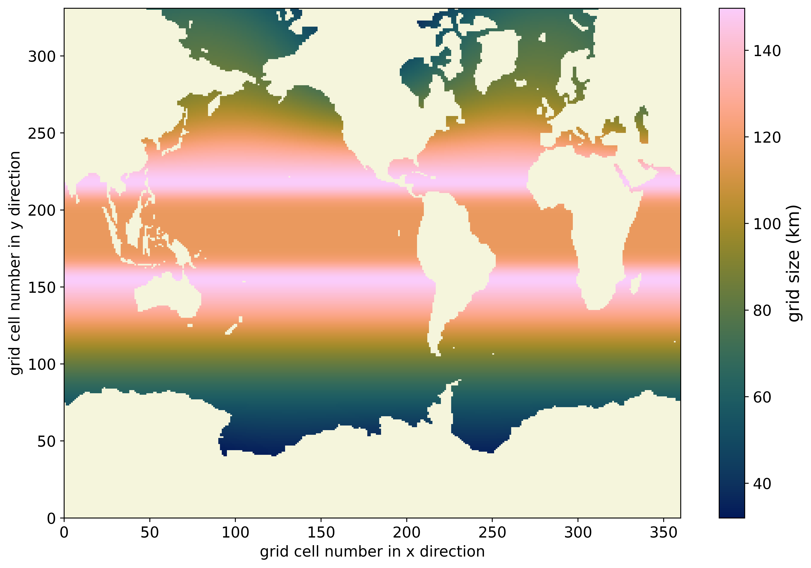
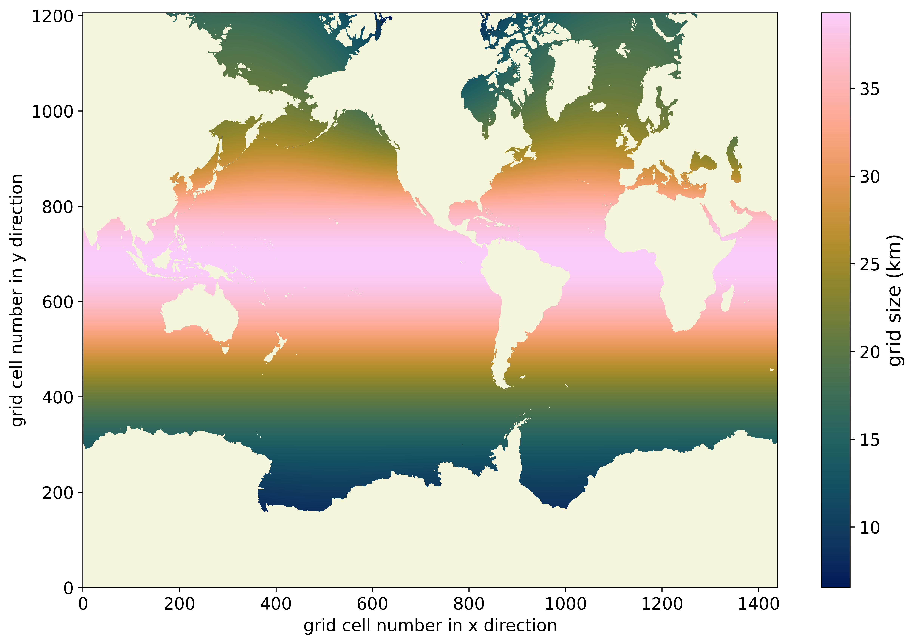

ECCC-CCCMa
===========================

NEMO modeling activities at Environment and Climate Change Canada (ECCC) can be roughly divided into short-term prediction and climate-scale. CONCEPTS (Canadian Operational Network of Coupled Environmental PredicTion Systems) is a partnership between ECCC, Fisheries and Oceans Canada (DFO), and the Department of National Defense (DND) and runs a short-term (10 days) forecast system that covers all of Canada's oceans at 1/12 degree and limited regions at 1/36 degree.

Climate-scale studies are centred at the Canadian Centre for Climate modelling and analysis (CCCma;  `Centre climate modelling analysis - Canada.ca`_). CCCma has been building global Earth System Models with prognostic ocean and land carbon cycles for almost two decades (Christian et al., 2010; Arora et al., 2011). We currently use the global earth system model CanESM (Swart et al., 2019).

CanNEMO is our version of NEMO that we use as the ocean and sea ice component for CanESM which is used for the Climate Model Intercomparison Project (CMIP). CanNEMO is also the ocean component for CCCma’s operational decadal predictions and for 1/2 of the ensemble members included in the Canadian Seasonal and Interannual Prediction System (CanSIPS), which provides seasonal predictions for Canada (the other 1/2 come from successive versions of the ECCC Meteorological Research Division's GEM-NEMO). Presently, we are working to develop the Canadian Three Oceans Downscaling System (CanTODS), a regional ocean domain that will cover Canada’s three oceans (we are starting off from the CONCEPTS Regional Ice Ocean Prediction System (RIOPS) grid), that will be used for climate downscaling as well as for downscaling of seasonal to decadal predictions. 

In addition to our NEMO based physical ocean model, we develop two biogeochemistry models, the Canadian Ocean Ecosystem model (CanOE; Christian et al, 2022), and the Canadian Model of Ocean Carbon (CMOC; Zahariev et al, 2008). 

The most recent published data are from CanESM5 and CanESM5-CanOE (Swart et al., 2019; Christian et al, 2022). CanESM6 is actively under development.

.. _Centre climate modelling analysis - Canada.ca: https://www.canada.ca/en/environment-climate-change/services/climate-change/science-research-data/modeling-projections-analysis/centre-modelling-analysis.html

Model Domains
-----------------
eORCA1: eORCA1 domain and grid size. Grid size is based on the diagonal line through the cell.

eORCA025: eORCA025 domain and grid size. Grid size is based on the diagonal line through the cell.

CanTODS: Our regional ocean domain. This is currently a work in progress.

Model Code
----------------
Our model code can be found here: `CCCma / CanESM · GitLab`_

.. _CCCma / CanESM · GitLab: https://gitlab.com/cccma/canesm

Members
-----------------
* Jim Christian (biogeochemical modelling): `Jim Christian | Directory of scientists and professionals`_ 
* Jonathan Izett (regional modelling): `Dr. Jonathan Izett | Directory of scientists and professionals`_ 
* Nicolas Lambert (global ocean): `Nicolas Lambert | Directory of scientists and professionals`_ 
* Bill Merryfield (seasonal to decadal predictions): `Dr. William Merryfield | Directory of scientists and professionals`_  
* Elise Olson (seasonal to decadal predictions): `Dr. Elise Olson | Directory of scientists and professionals`_  
* Natasha Ridenour (regional modelling): `Dr. Natasha Ridenour | Directory of scientists and professionals`_  
* Damien Ringeisen (sea ice): `Dr. Damien Ringeisen | Directory of scientists and professionals`_  
* Krysten Rutherford (biogeochemical modelling): `Dr. Krysten Rutherford | Directory of scientists and professionals`_  
* Geoff Stanley (global ocean): `Geoff Stanley | Directory of scientists and professionals`_  
* Nadja Steiner (biogeochemical modelling): `Nadja Steiner | Directory of scientists and professionals`_  
* Jean Sterlin (global ocean): `Jean Sterlin | Directory of scientists and professionals`_  
* Neil Swart (global earth system modelling): `Dr. Neil C. Swart | Directory of scientists and professionals`_  
* Duo Yang (global ocean): `Dr. Duo Yang | Directory of scientists and professionals`_ 

.. _Jim Christian | Directory of scientists and professionals: https://profils-profiles.science.gc.ca/en/profile/jim-christian
.. _Dr. Jonathan Izett | Directory of scientists and professionals: https://profils-profiles.science.gc.ca/en/profile/dr-jonathan-izett
.. _Nicolas Lambert | Directory of scientists and professionals: https://profils-profiles.science.gc.ca/en/profile/nicolas-lambert
.. _Dr. William Merryfield | Directory of scientists and professionals: https://profils-profiles.science.gc.ca/en/profile/dr-william-merryfield
.. _Dr. Elise Olson | Directory of scientists and professionals: https://profils-profiles.science.gc.ca/en/profile/dr-elise-olson
.. _Dr. Natasha Ridenour | Directory of scientists and professionals: https://profils-profiles.science.gc.ca/en/profile/dr-natasha-ridenour
.. _Dr. Damien Ringeisen | Directory of scientists and professionals: https://profils-profiles.science.gc.ca/en/profile/dr-damien-ringeisen
.. _Dr. Krysten Rutherford | Directory of scientists and professionals: https://profils-profiles.science.gc.ca/en/profile/dr-krysten-rutherford
.. _Geoff Stanley | Directory of scientists and professionals: https://profils-profiles.science.gc.ca/en/profile/geoff-stanley
.. _Nadja Steiner | Directory of scientists and professionals: https://profils-profiles.science.gc.ca/en/profile/nadja-steiner
.. _Jean Sterlin | Directory of scientists and professionals: https://profils-profiles.science.gc.ca/en/profile/jean-sterlin
.. _Dr. Neil C. Swart | Directory of scientists and professionals: https://profils-profiles.science.gc.ca/en/profile/dr-neil-c-swart
.. _Dr. Duo Yang | Directory of scientists and professionals: https://profils-profiles.science.gc.ca/en/profile/dr-duo-yang

Papers
-----------------

Model documenting papers
^^^^^^^^^^^^^^^^^^

* Improvements in the Canadian Earth System Model (CanESM) through systematic model analysis: CanESM5.0 and CanESM5.1 `(Sigmond et al., 2023)`_
* Ocean biogeochemistry in the Canadian Earth System Model version 5.0.3: CanESM5 and CanESM5-CanOE `(Christian et al., 2022)`_
* Decadal climate predictions with the Canadian Earth System Model version 5 (CanESM5) `(Sospedra-Alfonso et al., 2021)`_
* Carbon–concentration and carbon–climate feedbacks in CMIP6 models and their comparison to CMIP5 models `(Arora et al., 2020)`_
* The Canadian Earth System Model version 5 (CanESM5.0.3) `(Swart et al., 2019)`_

.. _(Christian et al., 2022): https://gmd.copernicus.org/articles/15/4393/2022/
.. _(Swart et al., 2019): https://gmd.copernicus.org/articles/12/4823/2019/
.. _(Sigmond et al., 2023): https://gmd.copernicus.org/articles/16/6553/2023/gmd-16-6553-2023.html
.. _(Sospedra-Alfonso et al., 2021): https://gmd.copernicus.org/articles/14/6863/2021/
.. _(Arora et al., 2020): https://bg.copernicus.org/articles/17/4173/2020/

Research papers
^^^^^^^^^^^^^^^^

* Ocean‐Only FAFMIP: Understanding Regional Patterns of Ocean Heat Content and Dynamic Sea Level Change `(Todd et al., 2020)`_
* Impact of Mesoscale Eddy Transfer on Heat Uptake in an Eddy-Parameterizing Ocean Model `(Saenko et al., 2018)`_ 
* Response of the North Atlantic dynamic sea level and circulation to Greenland meltwater and climate change in an eddy-permitting ocean model `(Saenko et al., 2016)`_
* Separating the influence of projected changes in air temperature and wind on patterns of sea level change and ocean heat content `(Saenko et al., 2015)`_
* Role of Resolved and Parameterized Eddies in the Labrador Sea Balance of Heat and Buoyancy `(Saenko et al., 2014)`_
* Ocean Heat Transport and Its Projected Change in CanESM2 `(Yang and Saenko, 2012)`_
* The global carbon cycle in the Canadian Earth system model (CanESM1): Preindustrial control simulation `(Christian et al., 2010)`_ 
* Preindustrial, historical, and fertilization simulations using a global ocean carbon model with new parameterizations of iron limitation, calcification, and N2 fixation `(Zahariev et al., 2008)`_

.. _(Zahariev et al., 2008): https://www.sciencedirect.com/science/article/pii/S0079661108000104?via%3Dihub
.. _(Christian et al., 2010): https://agupubs.onlinelibrary.wiley.com/doi/10.1029/2008JG000920
.. _(Yang and Saenko, 2012): https://journals.ametsoc.org/view/journals/clim/25/23/jcli-d-11-00715.1.xml
.. _(Saenko et al., 2018): https://journals.ametsoc.org/view/journals/clim/31/20/jcli-d-18-0186.1.xml
.. _(Saenko et al., 2016): https://link.springer.com/article/10.1007/s00382-016-3495-7
.. _(Saenko et al., 2015): https://agupubs.onlinelibrary.wiley.com/doi/10.1002/2015JC010928
.. _(Saenko et al., 2014): https://journals.ametsoc.org/view/journals/phoc/44/12/jpo-d-14-0041.1.xml
.. _(Todd et al., 2020): https://agupubs.onlinelibrary.wiley.com/doi/full/10.1029/2019MS002027

References
------------------

Arora, V., J. Scinocca, G. Boer, J. Christian, K. Denman, G. Flato, V. Kharin, W. Lee, and W. Merryfield (2011), Carbon emission limits required to satisfy future representative concentration pathways of greenhouse gases, Geophysical Research Letters, 38, doi:10.1029/2010GL046270.

Christian, J., et al. (2010), The global carbon cycle in the Canadian Earth system model (CanESM1): Preindustrial control simulation, Journal of Geophysical Research-Biogeosciences, 115, doi:10.1029/2008JG000920.

Christian, J. R., K. L. Denman, H. Hayashida, A. M. Holdsworth, W. G. Lee, O. G. J. Riche, A. E. Shao, N. Steiner, and N. C. Swart (2022), Ocean biogeochemistry in the Canadian Earth System Model version 5.0.3: CanESM5 and CanESM5-CanOE, Geoscientific Model Development, 15(11), doi:10.5194/gmd-15-4393-2022.

Swart, N., et al. (2019), The Canadian Earth System Model version 5 (CanESM5.0.3), Geoscientific Model Development, 12(11), 4823-4873, doi:10.5194/gmd-12-4823-2019.

Zahariev, K., J. Christian, and K. Denman (2008), Preindustrial, historical, and fertilization simulations using a global ocean carbon model with new parameterizations of iron limitation, calcification, and N-2 fixation, Progress in Oceanography, 77(1), 56-82, doi:10.1016/j.pocean.2008.01.007.

